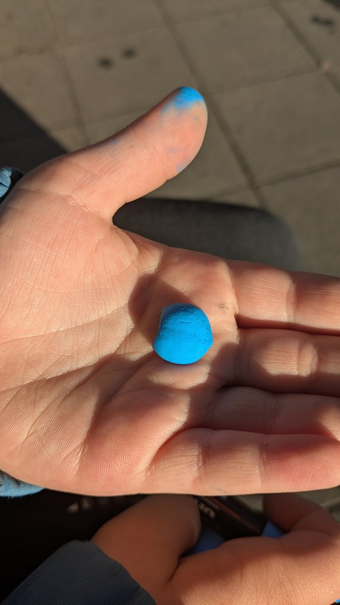
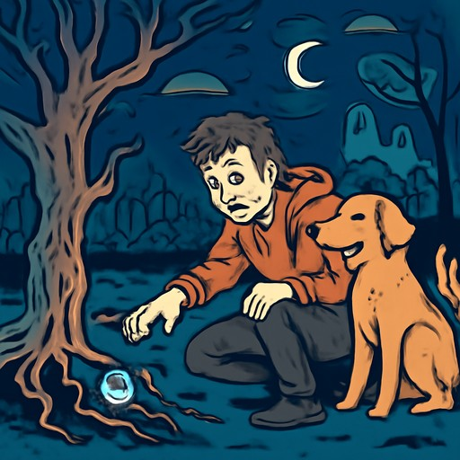
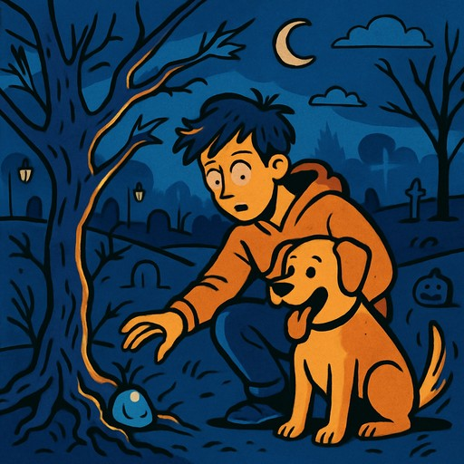
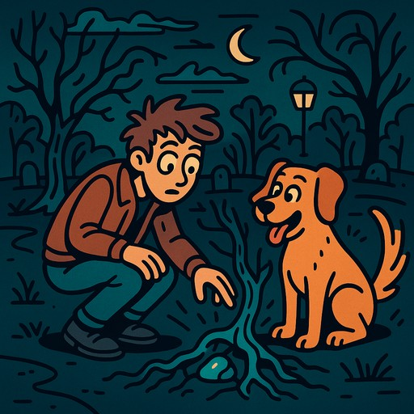

# Генерация иллюстраций: модель и стоимость

## Контекст

Раньше использовали `dall-e-3`. Сейчас эта модель в OpenAI Images API недоступна
(API возвращает `400: The model 'dall-e-3' does not exist`). То же касается
`dall-e-2`. Актуальная модель — `gpt-image-1`.

## Размер

`gpt-image-1` поддерживает только `1024x1024`, `1024x1536`, `1536x1024`, `auto`.
Генерировать сразу `512x512` нельзя — API отклоняет с
`Invalid size '512x512'. Supported sizes are 1024x1024, 1024x1536, 1536x1024, and auto`.
Поэтому в коде остаётся генерация в `1024x1024` с последующим уменьшением через PIL
до `512x512` JPEG.

## Качество и цена

У `gpt-image-1` есть параметр `quality`: `low` / `medium` / `high` / `auto`.
Это основной рычаг для управления стоимостью.

### Как считается цена

Ответ API содержит блок `usage` с разбивкой по токенам:

```json
"usage": {
  "input_tokens": 18,
  "input_tokens_details": { "image_tokens": 0, "text_tokens": 18 },
  "output_tokens": 272,
  "total_tokens": 290,
  "output_tokens_details": { "image_tokens": 272, "text_tokens": 0 }
}
```

Тарифы `gpt-image-1` (USD за 1M токенов):

| Тип | Тариф |
|---|---|
| Text input  | $5  |
| Image input (для edits) | $10 |
| Image output | $40 |

Формула:

```
cost = text_in_tokens / 1_000_000 * 5
     + img_in_tokens  / 1_000_000 * 10
     + img_out_tokens / 1_000_000 * 40
```

В нашем случае `image input = 0` (мы только генерируем, не редактируем), так что
доминирует `image_out * $40 / 1M`.

### Результаты эксперимента

Один и тот же промт (см. ниже), `size=1024x1024`, разные значения `quality`:

| Качество | text-in tok | image-out tok | Цена / картинку | ×к low | Сравнение с dall-e-3 std ($0.040) |
|---|---:|---:|---:|---:|---|
| **low**    | 128 |   272 | **$0.0115** |  1.00× | ~3.5× дешевле |
| **medium** | 128 |  1056 | **$0.0429** |  3.72× | примерно столько же |
| **high**   | 128 |  4160 | **$0.1670** | 14.50× | ~4× дороже |

Цифры стабильны от запуска к запуску — token count для одинаковой комбинации
`(size, quality)` детерминированный.

## Визуальное сравнение

Исходное фото (после сжатия до 1024 по длинной стороне для отправки в gpt-4o vision):



Сгенерированные иллюстрации (после уменьшения до 512×512 JPEG, как в продакшен-пайплайне):

| low (~$0.012) | medium (~$0.043) | high (~$0.167) |
|---|---|---|
|  |  |  |

## Промт для эксперимента

Сгенерирован `create_illustration_prompt` (gpt-4o-mini) на основе истории
«Эхо синего» (slug `blue-echo`), которая, в свою очередь, была сгенерирована
`gpt-4o` vision-моделью из исходного фото выше.

```
A young man, with tousled hair and a curious expression, squats down by a small,
gnarled tree in a dimly lit park. His large, friendly dog, with floppy ears and
an eager stance, sits beside him, its tail wagging excitedly. The man is
reaching out toward a shimmering blue stone nestled among the roots.

a flat, linear style with bold outlines and minimalistic, vibrant colors.
The scene should include whimsical and slightly eerie elements.
The overall aesthetic should combine a playful cartoonish feel with a touch of
spookiness, similar to a light-hearted horror theme.
```

## Воспроизведение

```python
from openai import OpenAI
client = OpenAI()

r = client.images.generate(
    model="gpt-image-1",
    prompt=prompt,
    size="1024x1024",
    quality="medium",   # или "low" / "high"
    n=1,
)

# Цена
TEXT_IN_RATE   = 5.0   # $/1M
IMAGE_OUT_RATE = 40.0  # $/1M
u = r.usage.model_dump()
cost = (
    u["input_tokens_details"]["text_tokens"]   / 1_000_000 * TEXT_IN_RATE
  + u["output_tokens_details"]["image_tokens"] / 1_000_000 * IMAGE_OUT_RATE
)

# Картинка — base64, не URL
import base64
img_bytes = base64.b64decode(r.data[0].b64_json)
```
